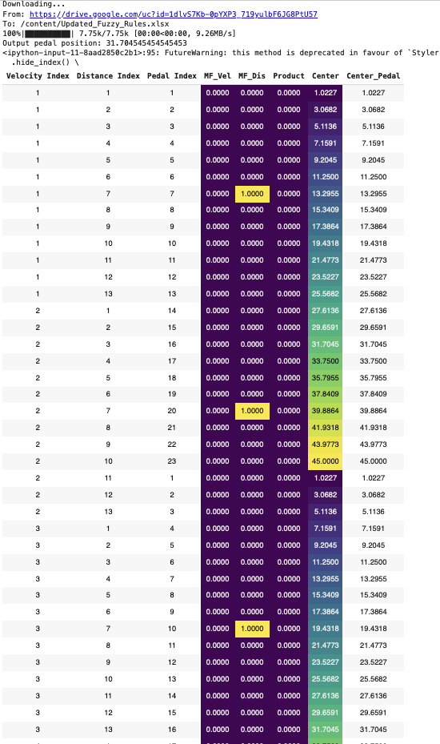
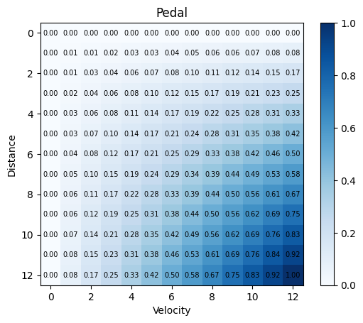

# Mamdani Fuzzy Inference System (FIS) Implementation

This repository contains a Python implementation of a Mamdani Fuzzy Inference System (FIS). It is designed to model complex systems using fuzzy logic to make decisions based on imprecise inputs. The system processes inputs through membership functions and applies fuzzy logic rules to compute an output that is defuzzified to a crisp value.

## Installation

To run this code, you will need Python installed on your system along with the following libraries:
- `pandas` for data manipulation and analysis.
- `numpy` and `matplotlib` for numerical computations and plotting.
- `gdown` for downloading data from Google Drive.

You can install the required packages using pip:

```bash
pip install pandas numpy matplotlib gdown
```

## Usage

There are two main components in this repository:

### Mamdani_FIS.py

This script defines a `Mamdani_FIS` class that:
- Initializes membership functions for input and output variables.
- Processes input data through these functions.
- Applies fuzzy logic rules to compute the degree of membership for outputs.
- Defuzzifies the output to obtain a crisp value.

To use the class, create an instance and call the `compute_output` method with velocity and distance as arguments:

```python
from Mamdani_FIS import Mamdani_FIS

fis = Mamdani_FIS()
output_pedal_position = fis.compute_output(velocity=60, distance=500)
print(f"Output pedal position: {output_pedal_position}")
```

### RuleTable.py

This script generates a heatmap representing the rules of the Fuzzy Inference System. It shows the interaction between velocity and distance inputs and their corresponding pedal output.

To generate the plot, simply run the script:

```bash
python RuleTable.py
```

## Visualization

Included in this repository are two images that visualize the components and outputs of the FIS:

- `mamdani.jpg`: Shows the styled DataFrame of fuzzy logic rules with highlighted degrees of membership.
- `RuleTable.jpg`: Displays a heatmap illustrating the relationship between input variables (velocity and distance) and the output variable (pedal).


*Styled DataFrame of FIS rules with degree of membership.*


*Heatmap of the FIS rule table.*

## Contributing

Contributions to this project are welcome. To contribute, please fork the repository, make your changes, and submit a pull request.

## License

This project is licensed under the MIT License - see the [LICENSE](LICENSE) file for details.
